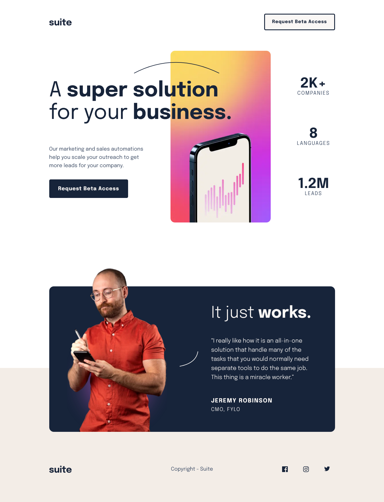
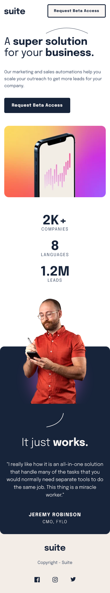

# Frontend Mentor - Suite landing page solution

This is a solution to the [Suite landing page challenge on Frontend Mentor](https://www.frontendmentor.io/challenges/suite-landing-page-tj_eaU-Ra). Frontend Mentor challenges help you improve your coding skills by building realistic projects.

## Table of contents

- [Frontend Mentor - Suite landing page solution](#frontend-mentor---suite-landing-page-solution)
  - [Table of contents](#table-of-contents)
  - [Overview](#overview)
    - [The challenge](#the-challenge)
    - [Desktop Screenshot](#desktop-screenshot)
    - [Tablet Screenshot](#tablet-screenshot)
    - [Mobile Screenshot](#mobile-screenshot)
    - [Links](#links)
  - [My process](#my-process)
    - [Built with](#built-with)
    - [Here comes the Magic ✨](#here-comes-the-magic-)
  - [Author](#author)

**Note: Delete this note and update the table of contents based on what sections you keep.**

## Overview

### The challenge

Users should be able to:

- [x] View the optimal layout depending on their device's screen size
- [x] See hover states for interactive elements

### Desktop Screenshot

### Tablet Screenshot

  
<b>Open tablet screenshot</b>

  

### Mobile Screenshot

  
<b>Open mobile screenshot</b>

  

### Links

- Solution URL: [Add solution URL here](https://your-solution-url.com)
- Live Site URL: [Add live site URL here](https://your-live-site-url.com)

## My process

### Built with

- Semantic HTML5 markup
- CSS custom properties
- Flexbox
- CSS Grid
- Mobile-first workflow

### Here comes the Magic ✨

To cope with overlapping elements apply `position: relative` without any **offset** and play with **negative margin.**

**Stark and Straight.**

## Author

- Website - [Astar Bahouidi](https://www.your-site.com)
- Frontend Mentor - [@Matondo99](https://www.frontendmentor.io/profile/Matondo99)
